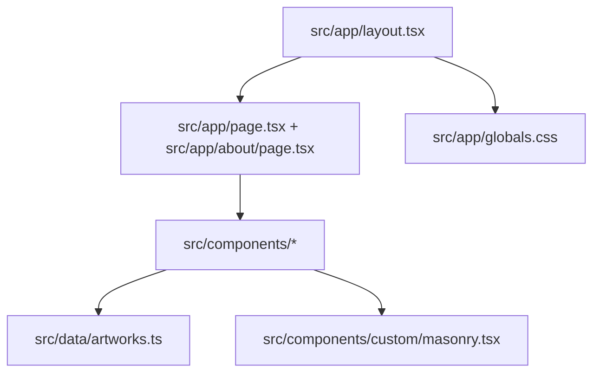

# Architecture Summary

The application is a client-heavy Next.js App Router site where the root layout owns persistent chrome and global styling while route files mostly delegate to focused UI components; the only large algorithmic module is a custom masonry engine used for responsive, virtualized artwork placement.

Related
- [../summary.md](../summary.md)
- [../routing/summary.md](../routing/summary.md)
- [../components/masonry-engine.md](../components/masonry-engine.md)
- [../ops/tooling-and-build.md](../ops/tooling-and-build.md)



```tsx
// Thin route pattern
import { PortfolioGrid } from "../components/PortfolioGrid";

export default function Home() {
  return <PortfolioGrid />;
}
```

Contracts
- Route components are intentionally thin and call into reusable components.
- Artwork content comes from static in-repo data rather than API calls.
- Global shell concerns stay in `src/app/layout.tsx`.

Invariants
- Header/footer render across all current routes.
- The masonry implementation used in production imports from `src/components/custom/masonry.tsx`.
- CSS tokens from `src/app/globals.css` back component utility classes.

Rationale
- Shared chrome in layout avoids route-level duplication.
- Static data keeps deployment simple and fully build-time deterministic.
- A custom masonry primitive gives control over behavior and performance tuning.

Lessons Learned
- Keep large low-level UI engines isolated from feature components.
- Route wrappers stay maintainable when data and rendering logic are delegated.
