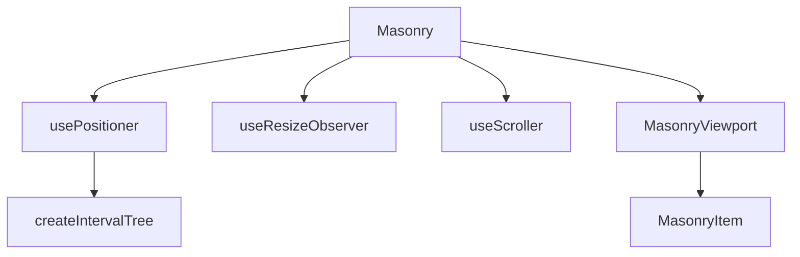

# Masonry Engine

The home gallery relies on a custom masonry implementation in `src/components/custom/masonry.tsx` that combines interval-tree indexing, resize observation, and viewport-aware rendering to place items in responsive columns.

Related
- [../ui/portfolio-grid.md](../ui/portfolio-grid.md)
- [../architecture/summary.md](../architecture/summary.md)
- [../practices.md](../practices.md)



```tsx
<Masonry columnWidth={420} maxColumnCount={3} gap={{ column: 24, row: 24 }}>
  {artworks.map((artwork, index) => (
    <MasonryItem key={`${artwork.title}-${index}`} asChild>
      <button>{/* artwork card */}</button>
    </MasonryItem>
  ))}
</Masonry>
```

Contracts
- Children must be rendered as `MasonryItem` descendants inside `Masonry`.
- Item registration requires measurable DOM nodes (`offsetHeight > 0`).
- Positioning assumes absolute layout inside a relatively positioned viewport container.

Invariants
- `src/components/custom/masonry.tsx` is the active import path used by `PortfolioGrid`.
- Column count adapts from container width and configured limits.
- ResizeObserver-driven updates keep item positions synchronized with measured heights.

Rationale
- This engine enables masonry behavior without introducing another external runtime dependency.
- Internal hooks expose tuning points (`overscan`, `scrollFps`, gaps, max columns).

Lessons Learned
- The repository currently contains two near-duplicate masonry files (`custom` and `ui`); treat `custom` as canonical until consolidation is decided.
