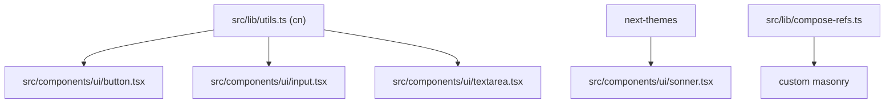

# Shared UI Primitives

The project includes shadcn/radix-style UI primitives (`button`, `input`, `label`, `textarea`, `spinner`, `sonner`) plus shared helpers (`cn`, composed refs), some actively used and others staged for upcoming contact/form workflows.

Related
- [../ops/tooling-and-build.md](../ops/tooling-and-build.md)
- [../ui/header-navigation.md](../ui/header-navigation.md)
- [../summary.md](../summary.md)



```tsx
const Toaster = ({ ...props }: ToasterProps) => {
  const { theme = "system" } = useTheme();
  return <Sonner theme={theme as ToasterProps["theme"]} {...props} />;
};
```

Contracts
- `cn(...)` combines `clsx` and `tailwind-merge` and is the standard class merging utility.
- UI primitives should consume semantic token classes (`bg-background`, `text-foreground`, etc.).
- `Toaster` theme follows the active `next-themes` value.

Invariants
- `src/lib/utils.ts` is the primary utility path used via `@/lib/utils` alias.
- A duplicate `lib/utils.ts` exists at repository root and is not the primary import target.
- Root layout mounts `Toaster` once for global toast rendering.

Rationale
- Keeping common primitives in `src/components/ui/` supports composability and future feature expansion.

Lessons Learned
- Track duplicate utility paths explicitly to avoid drift between `src/lib/` and top-level `lib/`.
