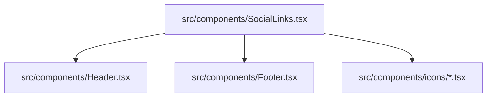

# Social Links Component

`SocialLinks` centralizes outbound social/contact link definitions and icon rendering so both header and footer share the exact same destinations and labels.

Related
- [../ui/header-navigation.md](../ui/header-navigation.md)
- [../summary.md](../summary.md)
- [../assets/static-assets.md](../assets/static-assets.md)



```tsx
const socialLinks = [
  { icon: InstagramIcon, href: "https://www.instagram.com/blackvomit.art", label: "Instagram" },
  { icon: Mail, href: "mailto:bv.design@hotmail.com", label: "Email" },
  { icon: TwitterIcon, href: "https://x.com/blackvomi7", label: "Twitter" },
];
```

Contracts
- External links open in a new tab when URL starts with `http`.
- Each link has an `aria-label` matching its platform/contact name.

Invariants
- SocialLinks currently renders exactly three links: Instagram, Email, Twitter/X.
- Header and footer both import this component rather than duplicating links.
- Social icon row and link wrappers enforce center alignment (`flex items-center`, `inline-flex items-center justify-center`) to keep mixed SVG/image icons level.
- Email uses a larger icon treatment (`h-8 w-8`) with slightly increased stroke (`strokeWidth={1.7}`) for visual parity with image-based social icons.

Rationale
- A single link registry prevents inconsistent contact destinations across layout areas.

Lessons Learned
- Consolidating repeated link sets improves maintainability and reduces update errors.
