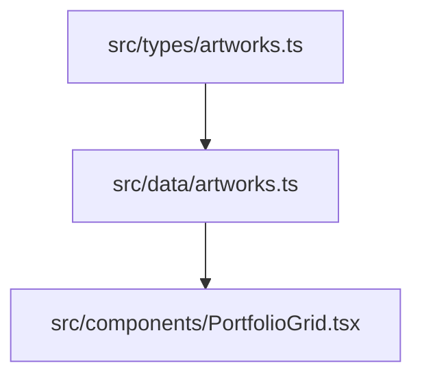

# Artworks Catalog

Artwork records are maintained as a typed static array in `src/data/artworks.ts` and consumed by the homepage portfolio grid; each item includes source path, display metadata, and aspect-ratio hints for masonry card sizing.

Related
- [../summary.md](../summary.md)
- [../ui/portfolio-grid.md](../ui/portfolio-grid.md)
- [../terminology.md](../terminology.md)



```ts
export interface ArtworkItem {
  src: string;
  alt: string;
  title: string;
  medium: string;
  year: string;
  aspectRatio: "portrait" | "square" | "landscape";
  aspectRatioValue?: string;
  width: number;
  height: number;
}
```

Contracts
- Dataset shape must satisfy `ArtworkItem[]`.
- `src` values reference files under `public/images/`.
- `aspectRatio` drives fallback ratio pools when `aspectRatioValue` is absent.

Invariants
- The current catalog contains 29 artworks.
- All entries are marked `Digital painting` and include year metadata.
- Image dimensions are currently fixed to `1024 x 1024` in metadata.

Rationale
- Static data provides predictable rendering and eliminates runtime fetch failure modes.
- Explicit ratios reduce layout shift and produce more controlled masonry flow.

Lessons Learned
- When asset naming or metadata capitalization changes, update both dataset and UX copy expectations together.
