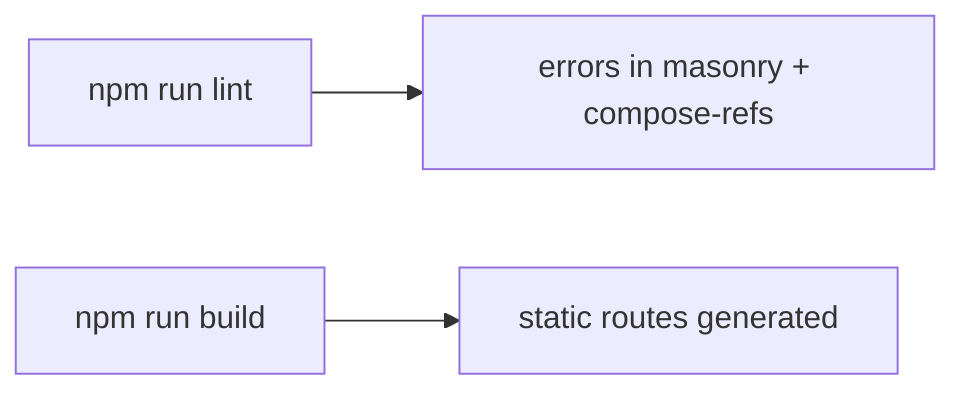

# Quality Status

Current quality checks show that production build succeeds, while linting reports hook/ref-rule violations primarily in masonry and ref-composition utilities.

Related
- [tooling-and-build.md](tooling-and-build.md)
- [../components/masonry-engine.md](../components/masonry-engine.md)
- [../summary.md](../summary.md)



```bash
npm run lint
npm run build
```

Contracts
- Lint status is authoritative from `npm run lint` in repository root.
- Build status is authoritative from `npm run build` in repository root.

Invariants
- Build currently passes and prerenders `/` and `/about` as static pages.
- Lint currently fails with `react-hooks/refs` and `react-hooks/use-memo` errors in:
  - `src/components/custom/masonry.tsx`
  - `src/components/ui/masonry.tsx`
  - `src/lib/compose-refs.ts`
- Lint also reports warnings for unused variables in masonry files.

Rationale
- Capturing quality state in Lode prevents future sessions from assuming lint is currently clean.

Lessons Learned
- Complex low-level hooks and ref utilities need explicit lint hardening before release gating on lint.
