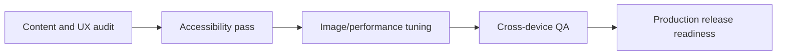

# Current Plan

Short-term plan for stabilizing and hardening the current portfolio implementation.

Related
- [Summary](../summary.md)
- [Terminology](../terminology.md)
- [Practices](../practices.md)
- [UI Summary](../ui/summary.md)
- [Routing Summary](../routing/summary.md)
- [Data Summary](../data/artworks-catalog.md)
- [Root Plan](../../plan.md)



```tsx
export default function Home() {
  return (
    <main>
      <PortfolioGrid />
    </main>
  );
}
```

Plan
1. Validate accessibility for icon-only links and lightbox keyboard interactions.
2. Decide whether `src/components/ui/masonry.tsx` is needed, since `src/components/custom/masonry.tsx` is the active implementation.
3. Add `rel="noreferrer noopener"` for external social links opened in new tabs.
4. Tune image loading strategy (priorities, sizes, potential blur placeholders).
5. Run lint/build/perf checks before deployment.

Invariants
- Home page remains the primary route entry point.
- Navigation stays available on desktop and mobile breakpoints.
- `plan.md` at repository root captures the execution checklist for current delivery phase.
