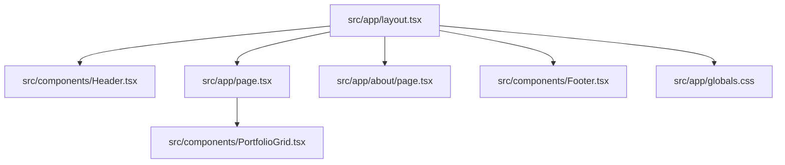

# Practices

Patterns and conventions currently used in this repository.

Related
- [Summary](summary.md)
- [Terminology](terminology.md)
- [Current Plan](plans/current-plan.md)
- [UI Summary](ui/summary.md)
- [Architecture Summary](architecture/summary.md)
- [Tooling and Build](ops/tooling-and-build.md)



```tsx
const [mobileOpen, setMobileOpen] = useState(false);

<button onClick={() => setMobileOpen(!mobileOpen)}>
  {mobileOpen ? <X className="h-6 w-6" /> : <Menu className="h-6 w-6" />}
</button>;
```

Practices
- Keep route files thin (`src/app/page.tsx` delegates to `PortfolioGrid`) and place substantial UI logic in `src/components/`.
- Use Tailwind utility classes for component styling; keep semantic design tokens centralized in `src/app/globals.css`.
- Mount global chrome (`Header`, `Footer`, `Toaster`) in the root layout so all routes share navigation and social links.
- Keep interactive/scroll-sensitive components client-side (`"use client"`) with state isolated per component.
- Store artwork data in typed arrays (`ArtworkItem[]`) under `src/data/` instead of embedding data in route files.
- Prefer shared building blocks (`SocialLinks`) to avoid duplicate link targets across header/footer.

Invariants
- `src/app/layout.tsx` always imports `src/app/globals.css`.
- `src/app/globals.css` defines Tailwind animation support with `@plugin 'tailwindcss-animate';`.
- `Header` visibility and mobile drawer state are controlled inside `src/components/Header.tsx`.
- `PortfolioGrid` selects modal content via a single `selectedArtwork` state object.
- `src/components/custom/masonry.tsx` is the canonical masonry implementation used by the homepage.
