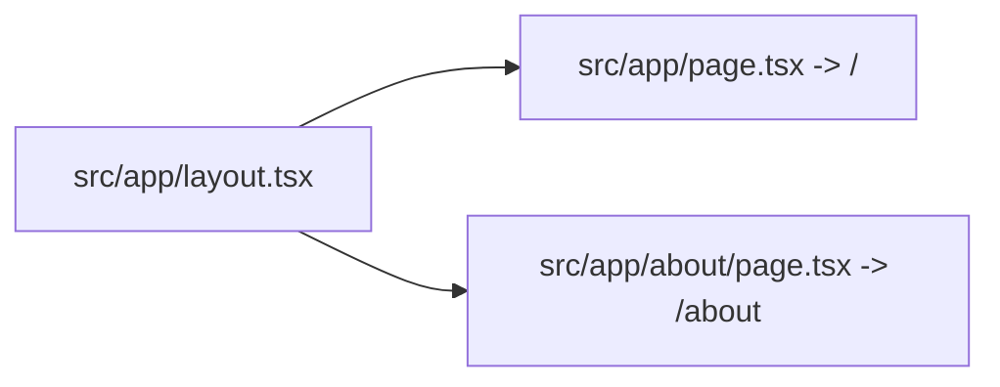

# Routing Summary

Routing uses Next.js App Router with two active page routes: `/` for the portfolio grid and `/about` for artist biography content, both wrapped by a single root layout that contributes metadata and shared UI chrome.

Related
- [../summary.md](../summary.md)
- [../ui/header-navigation.md](../ui/header-navigation.md)
- [../ui/portfolio-grid.md](../ui/portfolio-grid.md)



```ts
const navLinks = [
  { label: "Home", href: "/" },
  { label: "About", href: "/about" },
];
```

Contracts
- Every route under `src/app/` is wrapped by `src/app/layout.tsx`.
- Header active-link state derives from `usePathname()` and exact path matching.

Invariants
- `src/app/page.tsx` remains the home route entrypoint.
- `/about` content is route-level static JSX with no client state.
- Navigation targets route paths, not in-page anchors.

Rationale
- Route-based navigation allows independent page composition for gallery and biography.
- Keeping only two routes avoids complexity while content is still portfolio-first.

Lessons Learned
- Document nav intent as route links to prevent accidental reintroduction of anchor-based assumptions.
