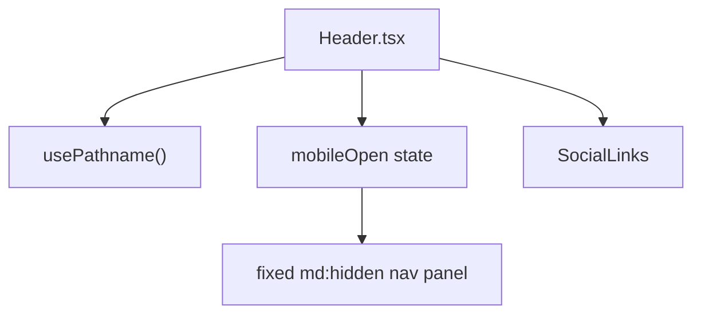

# Header Navigation

`Header` is a client component that renders brand identity, route links, and shared social icons with different desktop/mobile interaction models; desktop keeps inline links visible while mobile toggles a fixed panel.

Related
- [summary.md](summary.md)
- [../routing/summary.md](../routing/summary.md)
- [../components/shared-ui-primitives.md](../components/shared-ui-primitives.md)



```tsx
{navLinks.map((link) => {
  const isActive = pathname === link.href;
  return (
    <Link key={link.label} href={link.href} className={isActive ? "text-foreground underline" : "text-muted-foreground"}>
      {link.label}
    </Link>
  );
})}
```

Contracts
- Navigation links are declared in a single `navLinks` array.
- Mobile menu button must toggle `mobileOpen` and close when a mobile link is selected.
- Active state compares current pathname and link href exactly.

Invariants
- Header wrapper is sticky (`sticky top-0 z-50`) with backdrop blur.
- Desktop nav is hidden below `md`; mobile toggle is hidden at `md` and above.
- Social links are rendered in both desktop and mobile header contexts.

Rationale
- Shared nav link data keeps desktop and mobile paths synchronized.
- Sticky header keeps primary navigation reachable while users scroll galleries.

Lessons Learned
- Pathname-based exact match is simple and predictable for current flat routing.
