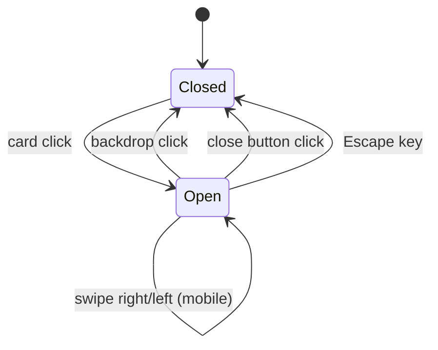

# Lightbox

The lightbox is a conditional full-screen dialog rendered by `PortfolioGrid` when an artwork is selected; it shows a large image preview plus title/medium/year metadata, supports multiple close interactions, and allows cyclic previous/next navigation by keyboard arrows, desktop side controls, and mobile swipe gestures.

Related
- [portfolio-grid.md](portfolio-grid.md)
- [../data/artworks-catalog.md](../data/artworks-catalog.md)
- [../practices.md](../practices.md)



```tsx
{selectedArtwork && (
  <div className="fixed inset-0 z-100" onClick={() => setSelectedIndex(null)} role="dialog" aria-modal="true">
    <button onClick={showPreviousArtwork} aria-label="Previous artwork" />
    <button onClick={showNextArtwork} aria-label="Next artwork" />
  </div>
)}
```

Contracts
- Dialog mount condition is `selectedArtwork !== null` where `selectedArtwork` derives from `selectedIndex`.
- Backdrop click closes modal; inner content uses `stopPropagation()` to prevent accidental close.
- Modal label includes selected artwork title for accessibility context.
- `ArrowLeft` and `ArrowRight` key handlers cycle index with wrap-around (`0` goes to last; last goes to `0`).
- Artwork preview area itself does not change selection on click.
- Swipe input with a horizontal threshold triggers previous/next artwork on touch devices.
- Previous/next navigation applies a brief horizontal push transition before and after index change across all viewport sizes.
- Title/metadata text hides immediately on previous/next transition (no fade-out phase).

Invariants
- Overlay uses near-black backdrop (`bg-black/90`) and blur effect.
- Artwork preview uses constrained dimensions (`max-h-[75vh]`, `max-w-5xl` container).
- Metadata panel always includes title, medium, and year.
- Side navigation arrows are shown on desktop (`md` and up) and hidden on mobile.
- Side arrows stay static in position and invert to a white background with black icon on hover.
- The preview image wrapper uses a full horizontal slide transition (`translate-x-full` / `-translate-x-full`) so next moves leftward and previous moves rightward.
- Metadata block waits `500ms` after the new image appears, then fades in over `1000ms`.

Rationale
- Co-locating modal state with card grid keeps interaction logic small and cohesive.
- Full-viewport overlay prioritizes artwork detail without route transitions.

Lessons Learned
- Keep key handlers and click handlers aligned so keyboard and mouse users get equivalent navigation flow.
