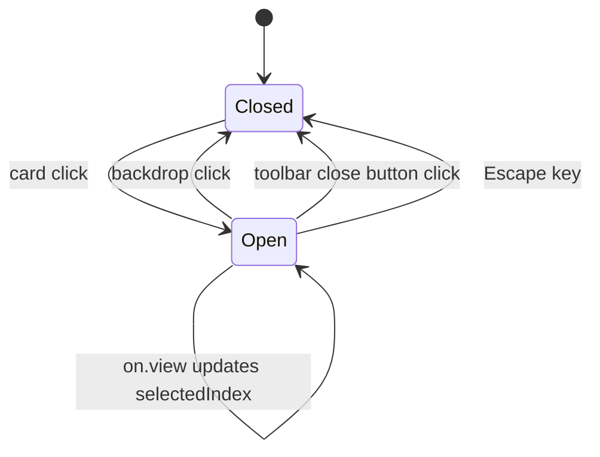

# Lightbox

The lightbox is powered by `yet-another-react-lightbox` and mounted from `PortfolioGrid` with index-based state; selecting any card opens the matching slide, and navigation (keyboard arrows, swipe, toolbar buttons, backdrop close, and `Escape`) is delegated to the library.

Related
- [portfolio-grid.md](portfolio-grid.md)
- [../data/artworks-catalog.md](../data/artworks-catalog.md)
- [../practices.md](../practices.md)



```tsx
<Lightbox
  open={selectedIndex !== null}
  close={() => setSelectedIndex(null)}
  index={selectedIndex ?? 0}
  slides={slides}
  on={{ view: ({ index }) => setSelectedIndex(index) }}
/>
```

Contracts
- Open state is derived from `selectedIndex !== null`; close always resets `selectedIndex` to `null`.
- Lightbox `index` is controlled by `selectedIndex ?? 0` so first open and controlled updates are deterministic.
- The `on.view` callback writes back the active slide index, keeping gallery state and lightbox state synchronized.
- Slide data is built from `artworks` (`src`, `alt`, `width`, `height`, `title`) and passed as `SlideImage[]`.
- Lightbox styles load globally from `yet-another-react-lightbox/styles.css` in the root layout.

Invariants
- Navigation is cyclic (`carousel.finite = false`) across the full artwork set.
- Backdrop click is enabled through the lightbox controller (`closeOnBackdropClick: true`).
- Transition timing is handled by library animation settings (`fade` and `swipe`).
- No custom focus-trap or keydown listeners are implemented in `PortfolioGrid` for lightbox behavior.

Rationale
- Using a battle-tested lightbox library reduces custom modal complexity and interaction bugs.
- Keeping index state in `PortfolioGrid` preserves direct card-to-slide mapping.

Lessons Learned
- If `yet-another-react-lightbox` appears unstyled or invisible, verify the global stylesheet import first.
