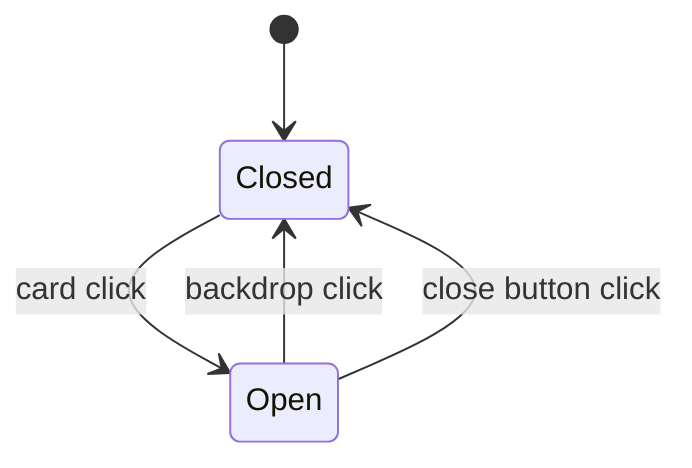

# Lightbox

The lightbox is a conditional full-screen dialog rendered by `PortfolioGrid` when an artwork is selected; it shows a large image preview plus title/medium/year metadata and supports multiple close interactions.

Related
- [portfolio-grid.md](portfolio-grid.md)
- [../data/artworks-catalog.md](../data/artworks-catalog.md)
- [../practices.md](../practices.md)



```tsx
{selectedArtwork && (
  <div className="fixed inset-0 z-100" onClick={() => setSelectedArtwork(null)} role="dialog" aria-modal="true">
    <button onClick={() => setSelectedArtwork(null)} aria-label="Close lightbox" />
  </div>
)}
```

Contracts
- Dialog mount condition is `selectedArtwork !== null`.
- Backdrop click closes modal; inner content uses `stopPropagation()` to prevent accidental close.
- Modal label includes selected artwork title for accessibility context.

Invariants
- Overlay uses near-black backdrop (`bg-black/90`) and blur effect.
- Artwork preview uses constrained dimensions (`max-h-[75vh]`, `max-w-5xl` container).
- Metadata panel always includes title, medium, and year.

Rationale
- Co-locating modal state with card grid keeps interaction logic small and cohesive.
- Full-viewport overlay prioritizes artwork detail without route transitions.

Lessons Learned
- Keyboard escape/focus-trap behavior is not yet implemented and should be treated as a next hardening task.
