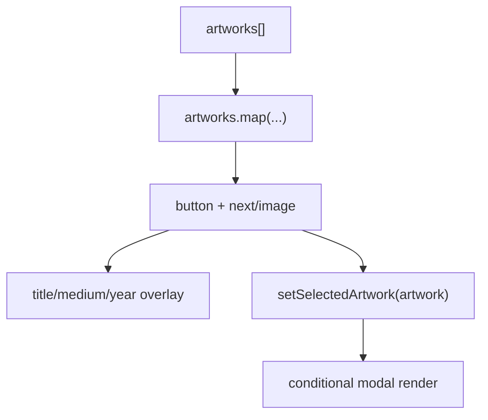

# Portfolio Grid

`PortfolioGrid` is the homepage feature component that maps typed artwork data into interactive masonry cards with image overlays, responsive columns, and click-to-open detail preview.

Related
- [summary.md](summary.md)
- [lightbox.md](lightbox.md)
- [../data/artworks-catalog.md](../data/artworks-catalog.md)
- [../components/masonry-engine.md](../components/masonry-engine.md)



```tsx
const aspectRatio = artwork.aspectRatioValue ?? aspectRatioFallback;

<button style={{ aspectRatio }} onClick={() => setSelectedArtwork(artwork)}>
  <Image src={artwork.src} alt={artwork.alt} fill className="object-cover" />
</button>
```

Contracts
- Each card is a keyboard-focusable button with `aria-label`.
- Aspect ratio is always set per card using explicit value or category fallback.
- Masonry children are wrapped in `MasonryItem asChild` for positioning.

Invariants
- Grid uses `columnWidth={420}` and `maxColumnCount={3}` with 24px column/row gaps.
- Overlay metadata reveals on hover at `sm` and above, always visible on smaller screens.
- Card interactions are local client state only and do not mutate data source.

Rationale
- A static array + client rendering provides fast startup and deterministic ordering.
- Ratio hints reduce visual jank compared with purely measured first-pass layout.

Lessons Learned
- Include meaningful `alt` and metadata fields in the dataset to keep gallery cards and modal details aligned.
